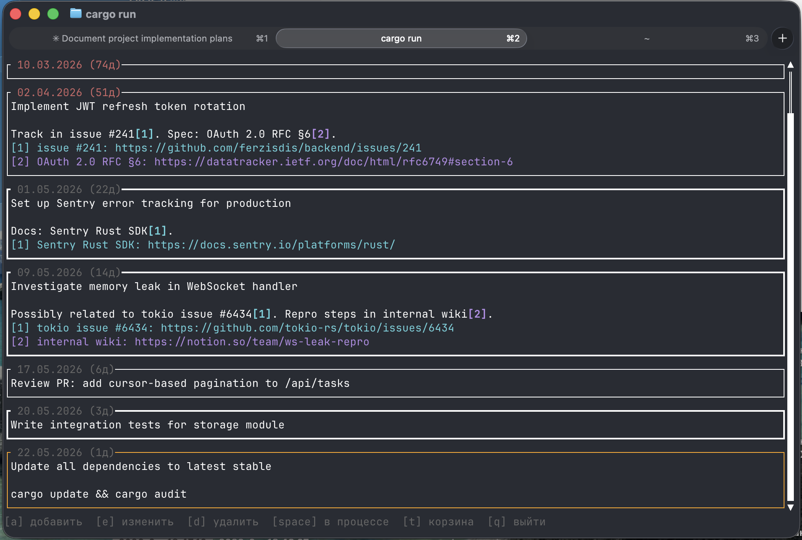

# tasker

A minimalist terminal task manager written in Rust.

Tasks are displayed as cards in the terminal. Data is stored in a single JSON file — no daemon, no database, no configuration required.



## Features

- **Card-based UI** — each task is a bordered card; the selected task has an orange border; in-progress tasks have a thick border
- **Age indicator** — creation date and day count shown in the card header; turns red after 30 days
- **Markdown-style links** — write `[text](url)` in task text; links are rendered as footnotes with distinct colors
- **Smart paste** (`Cmd/Ctrl+V`) — automatically converts copied HTML (e.g. from a browser) into `[text](url)` format; falls back to plain text
- **Soft delete with Trash mode** — deleted tasks move to a trash bin; restore or permanently remove them from there
- **Mouse support** — click to select a card, scroll wheel to navigate
- **Russian keyboard layout** — all shortcuts have Russian-key equivalents
- **Cross-platform** — macOS and Windows

## Installation

**From source:**

```bash
git clone https://github.com/ferzisdis/tasker
cd tasker
cargo build --release
# binary will be at target/release/tasker
```

**Or install directly with Cargo:**

```bash
cargo install --path .
```

## Usage

Run `tasker` from any directory. Tasks are saved to `tasks.json` in the current working directory, so you can have a separate task list per project.

```bash
cd ~/projects/my-project
tasker
```

### Keyboard shortcuts

#### Normal mode

| Key | Russian | Action |
|-----|---------|--------|
| `↑` / `k` | `л` | Move up |
| `↓` / `j` | `о` | Move down |
| `a` | `ф` | Add a new task |
| `e` | `у` | Edit the selected task |
| `d` | `в` | Delete task (moves to Trash) |
| `Space` | | Toggle "in progress" |
| `t` | `е` | Open Trash |
| `q` | `й` | Quit |

#### Add / Edit mode

| Key | Action |
|-----|--------|
| `Cmd+S` / `Ctrl+S` | Save |
| `Esc` | Cancel |
| `Cmd+V` / `Ctrl+V` | Smart paste |

#### Trash mode

| Key | Russian | Action |
|-----|---------|--------|
| `↑` / `k` | `л` | Move up |
| `↓` / `j` | `о` | Move down |
| `r` | `к` | Restore selected task |
| `d` | `в` | Permanently delete |
| `t` | `е` | Back to Normal |
| `q` | `й` | Quit |

### Links in tasks

Write links using Markdown link syntax:

```
Fix the bug described in [issue #42](https://github.com/org/repo/issues/42)
See also [the RFC](https://example.com/rfc)
```

Links are displayed inline as `text[N]` and collected as colored footnotes at the bottom of the card.

When you copy a link from a browser and paste with `Cmd/Ctrl+V`, tasker automatically extracts the URL and link text from the HTML clipboard, inserting `[text](url)` for you.

## Data format

Tasks are stored in `tasks.json` as a JSON array:

```json
[
  {
    "id": 1,
    "text": "Write documentation",
    "in_progress": false,
    "created_at": "2026-05-23",
    "deleted": false
  }
]
```

The file is saved immediately after every change. Deleted tasks remain in the file with `"deleted": true` until permanently removed from Trash.

## Requirements

- Rust 1.70+
- A terminal with 256-color support
- For `Cmd+S` / `Cmd+V` on macOS: a terminal that supports the [Kitty keyboard protocol](https://sw.kovidgoyal.net/kitty/keyboard-protocol/) (Kitty, WezTerm, Ghostty, iTerm2). In other terminals use `Ctrl+S` / `Ctrl+V`.

## License

[MIT](LICENSE) © 2026 ferzisdis
